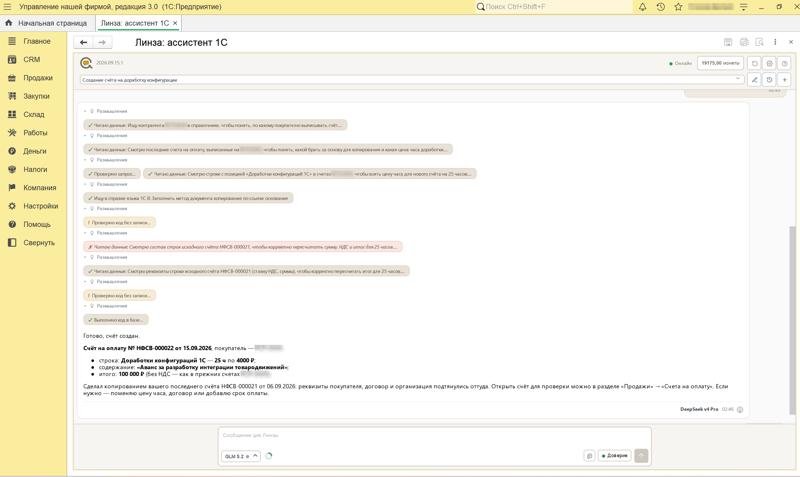

# Линза Ассистент 1С

Внешняя обработка для 1С:Предприятие: ИИ-ассистент, который работает в вашей базе.
Спрашиваете словами - он читает структуру конфигурации и сами документы, отвечает по
вашим данным, а по вашему разрешению заполняет, проводит и создает документы.

**Обработка бесплатна.** Забирайте в [Releases](../../releases/latest).

Код внутри открыт: обработка открывается в конфигураторе, читается и правится. Права на
продукт остаются у правообладателя, условия в [LICENSE.md](LICENSE.md).

  

Попросили выписать счет - ассистент нашел контрагента, взял цену часа из прошлых счетов и
создал документ сам, в режиме «Доверие». Каждый шаг виден в ленте: проверил код без записи,
выполнил в базе, отчитался.

## Что умеет

- **Смотрит в вашей базе, а не гадает.** Читает метаданные конфигурации и документы, на
  экране видно каждый шаг: какие объекты нашел, какую структуру прочитал.
- **Меняет данные, а не только советует.** Заполнить реквизит, перепровести документ,
  поправить справочник, выписать счет.
- **Что можно делать - решаете вы.** Переключатель в строке ввода: «Контроль» спрашивает
  перед каждым действием и показывает код до исполнения, «Доверие» действует сам.
- **Ссылки в ответе настоящие.** Ответ таблицей, клик по документу открывает его форму.
- **Ходит в интернет и в справку платформы.** Отделит финальный релиз от тестового и даст
  ссылку на первоисточник; про параметры метода процитирует синтакс-помощник, а не память
  нейросети.
- **Нейросеть под задачу.** Claude, GPT, Gemini, DeepSeek и другие - выбор в строке ввода.

  

## Что это

Одна внешняя обработка `.epf`. Работает на платформе 8.3 и 8.5, расширение конфигурации
не требуется, правок в конфигураторе нет. Нужен интернет.

## Как начать

1. Скачайте `.epf` из [Releases](../../releases/latest).
2. Откройте ее в 1С:Предприятие.
3. Подключение - в настройках в шапке чата; доступ выдается в личном кабинете на
   [digitalmechanics.dev](https://digitalmechanics.dev/lensa/assistant?utm_source=github_assistant&utm_medium=repo&utm_campaign=gh-assistant-readme).

Перед первой работой на рабочей базе сделайте копию - ассистент умеет записывать.

## Родственник

[Консоль запросов 1С с ИИ «Линза»](https://github.com/SgonnovDmGit/lensa-query-console) -
та же идея для разработчика: ИИ-помощник по метаданным собирает запрос, из запроса
получается внешний отчет или обработка.
