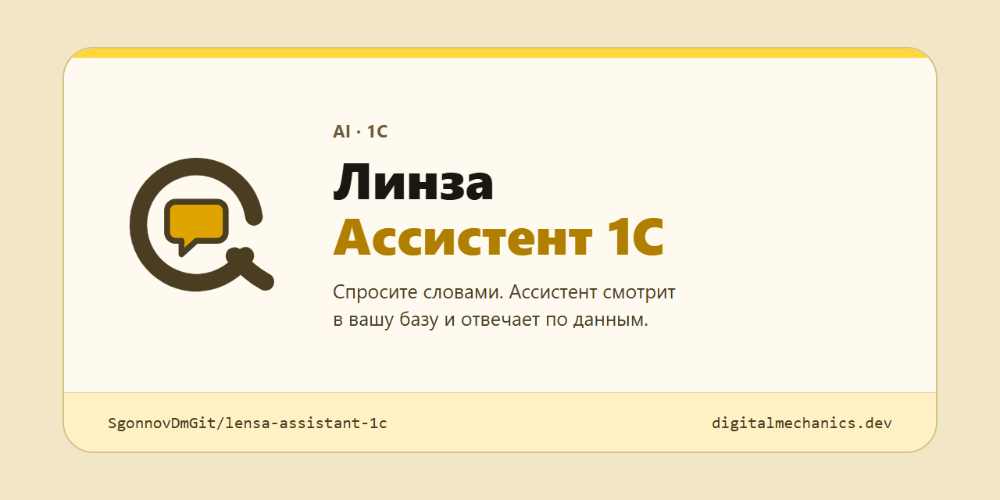
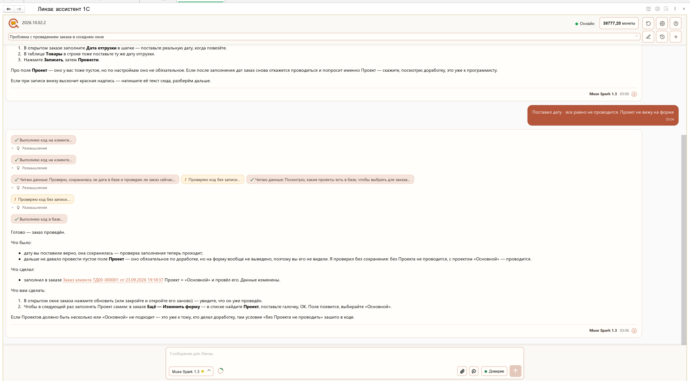
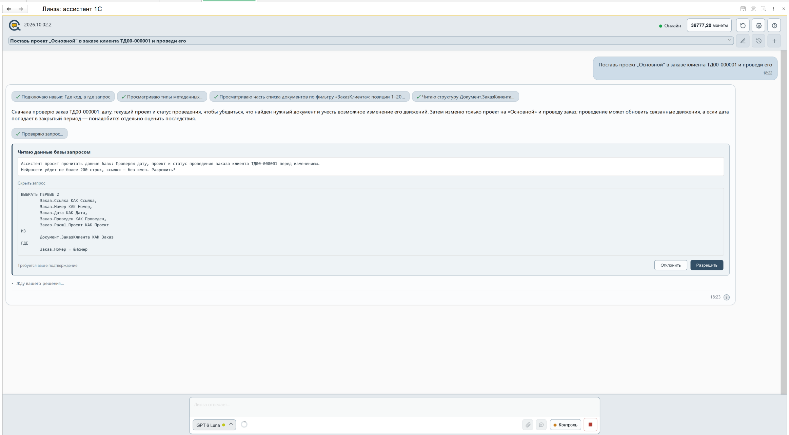
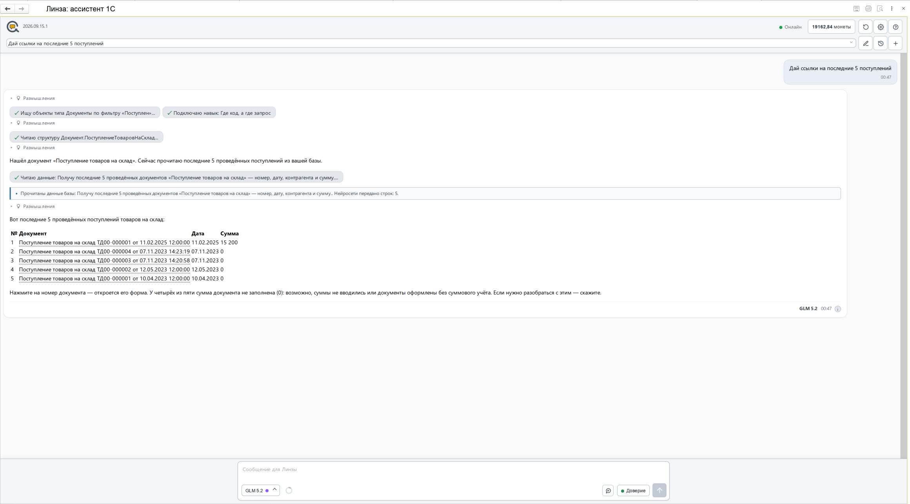
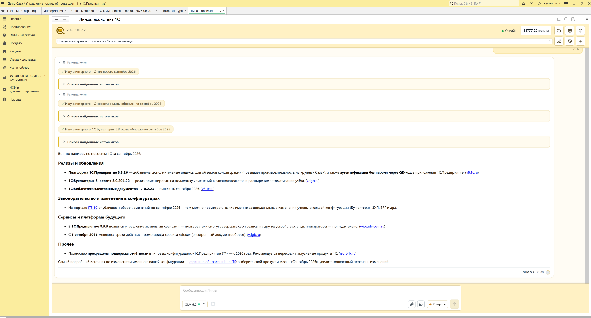
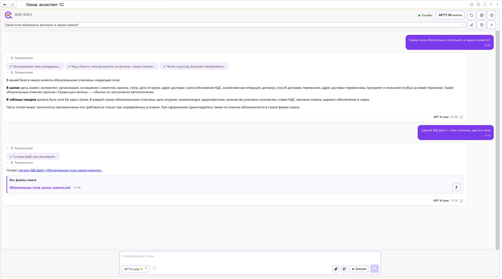

  

  
  
  

# Линза Ассистент 1С

Внешняя обработка для 1С:Предприятие: ИИ-ассистент, который работает в вашей базе.
Спрашиваете словами - он читает структуру конфигурации и сами документы, отвечает по
вашим данным, а по вашему разрешению заполняет, проводит и создает документы.

**Обработка бесплатна и бессрочна.** Забирайте в [Releases](../../releases/latest).

Код внутри открыт: обработка открывается в конфигураторе, читается и правится. Права на
продукт остаются у правообладателя, условия в [LICENSE.md](LICENSE.md).

  

Заказ не проводился. Ассистент проверил в базе, что дата сохранилась, нашел пустое
обязательное поле «Проект», которого нет на форме, проверил исправление без записи, заполнил
поле и провел заказ - в режиме «Доверие». Каждый шаг виден в ленте, а в ответе сказано, что
данные изменены.

## Зачем это

Три вещи, из-за которых ИИ в 1С обычно не взлетает, - и что с ними здесь.

- **Нейросеть не знает вашу конфигурацию** и выдумывает имена объектов и реквизитов. Здесь
  ассистент сначала читает метаданные вашей базы и сами документы, и только потом отвечает.
  Каждый его шаг виден в ленте.
- **Страшно пускать ИИ к учетной базе.** Что можно делать, решаете вы. В режиме «Контроль»
  ассистент показывает код и спрашивает перед каждым действием (кадр ниже); в режиме «Доверие»
  действует сам, но оставляет в ленте карточку с описанием и результатом.
- **Обвязка из расширений, плагинов и отдельных серверов - это проект по установке.** Здесь
  одна внешняя обработка `.epf`: расширение конфигурации не нужно, правок в конфигураторе нет.

## Что умеет

- **Смотрит в вашей базе, а не гадает.** Читает метаданные конфигурации и документы, на
  экране видно каждый шаг: какие объекты нашел, какую структуру прочитал.
- **Меняет данные, а не только советует.** Заполнить реквизит, перепровести документ,
  поправить справочник, выписать счет.
- **Ссылки в ответе настоящие.** Ответ таблицей, клик по документу открывает его форму.
- **Ходит в интернет и в справку платформы.** Отделит финальный релиз от тестового и даст
  ссылку на первоисточник; про параметры метода процитирует синтакс-помощник, а не память
  нейросети.
- **Нейросеть под задачу.** Claude, GPT, Gemini, DeepSeek и другие - выбор в строке ввода.

## Как это выглядит

**Под «Контролем» ассистент спрашивает.** Попросили поставить проект «Основной» в заказе клиента и
провести его. Прежде чем читать базу, ассистент показал, что именно прочитает: описание, текст
запроса и число строк, которое уйдет нейросети (не более 200). Дальше он ждет вашего решения -
«Разрешить» или «Отклонить».

  

**Ответ таблицей, ссылки живые.** Попросили посмотреть последние четыре реализации - ассистент
прочитал документы и ответил таблицей. Документ, склад и контрагент подчеркнуты: клик открывает
форму.

  

**Идет в интернет и называет источники.** Попросили найти, что нового в 1С в этом месяце.
Ассистент сделал три поиска, источники свернул в списки под каждым, а в ответе дал ссылки на
первоисточники.

  

**Знает структуру вашей базы и отдает результат файлом.** Спросили, какие поля обязательны в
заказе клиента, - ассистент прочитал структуру документа и ответил по вашей конфигурации. Потом
попросили оформить это файлом: он собрал `.md` и положил в «Все файлы ответа».

  

## Требования

| | |
|---|---|
| Платформа | 1С:Предприятие 8.3 и 8.5 |
| Формат | Одна внешняя обработка `.epf`, расширение конфигурации не требуется |
| Доступ в сеть | Нужен: нейросети подключены через сервис «Линза» |

## Как начать

1. Скачайте `.epf` из [Releases](../../releases/latest) - регистрация для скачивания не нужна.
2. Откройте ее в 1С:Предприятие.
3. Подключение к сервису - в настройках в шапке чата; доступ выдается в личном кабинете на
   [digitalmechanics.dev](https://digitalmechanics.dev/lensa/assistant?utm_source=github_assistant&utm_medium=repo&utm_campaign=gh-assistant-readme).

Перед первой работой на рабочей базе сделайте копию - ассистент умеет записывать.

## О сервисе «Линза»

Обработка - клиент сервиса «Линза» от Лаборатории цифровой механики: нейросети и обмен с
ними идут через сервис. Сама обработка лежит здесь бесплатно, а сервисные возможности
подключаются отдельно, на [digitalmechanics.dev](https://digitalmechanics.dev/lensa/assistant?utm_source=github_assistant&utm_medium=repo&utm_campaign=gh-assistant-readme).

## Документация

- [Что нового](docs/ЧтоНового.md) - список изменений по версиям
- [Справка](docs/Справка_ЛинзаАссистент1С.md) - руководство пользователя. Та же справка
  встроена в саму обработку, кнопка «?».

## Лицензия

Обработка распространяется бесплатно и бессрочно. Это **не open source** - исходный код
открыт для чтения и правки внутри вашей 1С, но права на продукт принадлежат правообладателю.
Условия - [LICENSE.md](LICENSE.md).

## Обратная связь

Вопросы, ошибки и пожелания - в [Issues](../../issues).

## Родственник

[Консоль запросов 1С с ИИ «Линза»](https://github.com/SgonnovDmGit/lensa-query-console) -
та же идея для разработчика: ИИ-помощник по метаданным собирает запрос, из запроса
получается внешний отчет или обработка.
